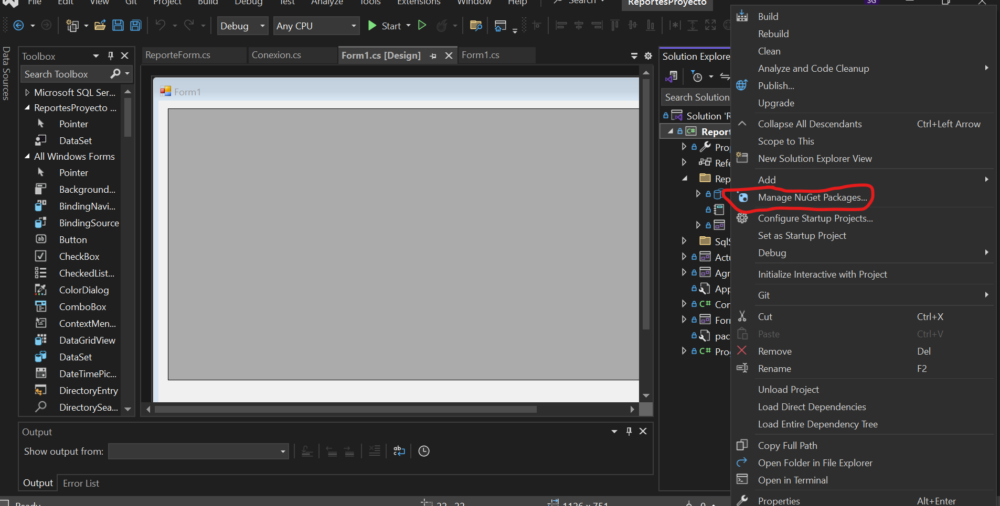
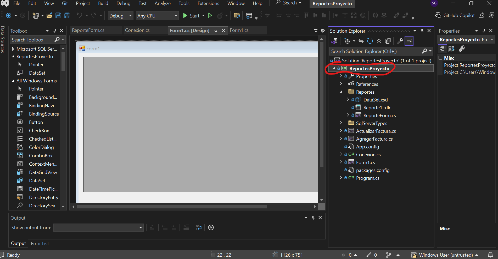
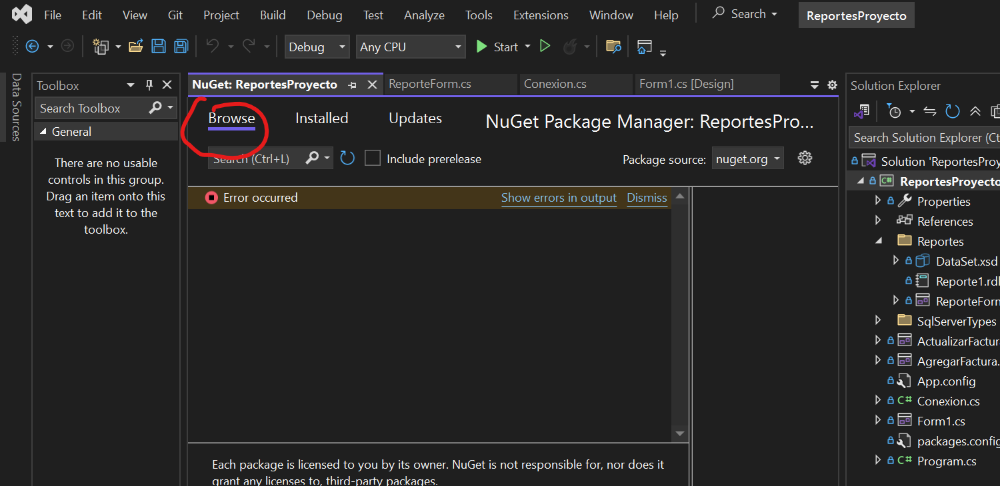
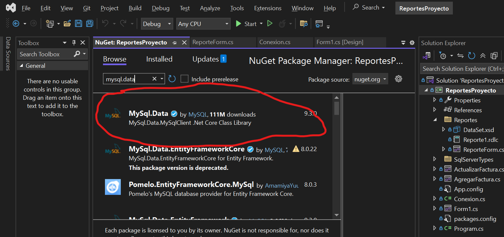

# 📘 Guía para Principiantes: Cómo Crear Reportes en PHP Paso a Paso

Bienvenido a esta guía completa donde te enseñaremos cómo crear reportes en **PHP**. Esta guía está pensada para principiantes que **no tienen experiencia previa**, por lo que explicaremos **todo desde cero**, paso a paso.

## 🌐 Crear Reportes en PHP con phpMyAdmin

### ✅ ¿Qué necesitas?

- Instalar XAMPP o WAMP.
```
https://www.apachefriends.org/es/index.html
```

- Acceder a **phpMyAdmin**.


- Crear archivos `.php`.


> ### 🧱 Paso 1: Crear la base de datos en phpMyAdmin

1. Abre tu navegador y escribe `localhost/phpmyadmin`.



2. Crea una base de datos llamada `BD_FacturacionPruebas`.

```sql
CREATE TABLE factura (
    id INT AUTO_INCREMENT PRIMARY KEY,
    descripcion VARCHAR(255),
    categoria VARCHAR(100),
    cantidad INT,
    precio_unitario DECIMAL(10,2),
    itebis DECIMAL(10,2),
    descuento DECIMAL(10,2),
    total_general DECIMAL(10,2)
);
```


> ### 🧱 Paso 2: Crear los archivos en una carpeta

Crea una carpeta llamada `facturas` dentro de `htdocs`, y agrega estos archivos:

```
htdocs/
└── facturas/
    ├── conexion.php
    ├── guardar_factura.php
    ├── reporte_facturas.php
    ├── imprimir_pdf.php
    ├── editar.php
    ├── eliminar.php
    ├── formulario.php
    ├── actualizar.php
    ├── estilos.css
```


> ### 🧱 Paso 3: Conexión en PHP (conexion.php)

```php
<?php
$servidor = "localhost";
$usuario = "root";
$password = "";
$base_datos = "bd_facturacionpruebas";

$conexion = mysqli_connect($servidor, $usuario, $password, $base_datos);

if (!$conexion) {
    die("Conexión fallida: " . mysqli_connect_error());
} else {
    echo "Conexión exitosa a la base de datos.";
}
?>

```


> ### 🧱 Paso 4: Mostrar el reporte (reporte_facturas.php)

```HTML
<?php
include 'conexion.php';

$resultado = $conexion->query("SELECT * FROM factura");
?>

<!DOCTYPE html>
<html>
<head>
    <title>Reporte de Facturas</title>
    <link rel="stylesheet" href="estilos.css">
</head>
<body>
    <h2>Reporte de Facturas</h2>
    <table border="1">
        <tr>
            <th>ID</th>
            <th>DESCRIPCIÓN</th>
            <th>CATEGORÍA</th>
            <th>CANTIDAD</th>
            <th>PRECIO UNITARIO</th>
            <th>ITEBIS</th>
            <th>DESCUENTO</th>
            <th>TOTAL GENERAL</th>
            <th>ACCIONES</th>
        </tr>
        <?php while ($fila = mysqli_fetch_assoc($resultado)) : ?>
            <tr>
                <td><?= $fila['id'] ?></td>
                <td><?= $fila['descripcion'] ?></td>
                <td><?= $fila['categoria'] ?></td>
                <td><?= $fila['cantidad'] ?></td>   
                <td><?= number_format($fila['precio_unitario'], 2) ?></td>
                <td><?= number_format($fila['itebis'], 2) ?></td>
                <td><?= number_format($fila['descuento'], 2) ?></td>
                <td><?= number_format($fila['total_general'], 2) ?></td>
                <td>
                    <a href="imprimir_pdf.php?id=<?= $fila['id'] ?>" target="_blank" class="btn btn-sm btn-primary">Imprimir PDF</a>
                    <a href="editar.php?id=<?= $fila['id'] ?>" class="btn btn-sm btn-warning">Editar</a>
                    <a href="eliminar.php?id=<?= $fila['id'] ?>" class="btn btn-sm btn-danger" onclick="return confirm('¿Estás seguro de eliminar esta factura?')">Eliminar</a>
                </td>
            </tr>
        <?php endwhile; ?>
    </table>
</body>
</html>

```


> ### 🧱 Paso 5: Imprimir reporte en PDF (imprimir_pdf.php)

1. Descarga la librería TCPDF desde [tcpdf.org](https://sourceforge.net/projects/tcpdf/).
2. Crea el archivo con este código:

```php
<?php
require_once('tcpdf/tcpdf.php');
include 'conexion.php';

$id = isset($_GET['id']) ? intval($_GET['id']) : 0;

$sql = "SELECT * FROM factura WHERE id = $id";
$resultado = $conexion->query($sql);
$fila = $resultado->fetch_assoc();

if (!$fila) {
    die("Factura no encontrada");
}

$pdf = new TCPDF();
$pdf->AddPage();
$pdf->SetFont('helvetica', '', 12);

$html = '
<h2>Factura N.º ' . $fila['ID'] . '</h2>
<table border="1" cellpadding="5">
<tr><td><b>Descripción</b></td><td>' . $fila['DESCRIPCION'] . '</td></tr>
<tr><td><b>Categoría</b></td><td>' . $fila['CATEGORIA'] . '</td></tr>
<tr><td><b>Cantidad</b></td><td>' . $fila['CANTIDAD'] . '</td></tr>
<tr><td><b>Precio Unitario</b></td><td>' . number_format($fila['PRECIO_UNITARIO'], 2) . '</td></tr>
<tr><td><b>ITEBIS</b></td><td>' . number_format($fila['ITEBIS'], 2) . '</td></tr>
<tr><td><b>Descuento</b></td><td>' . number_format($fila['DESCUENTO'], 2) . '</td></tr>
<tr><td><b>Total General</b></td><td><b>' . number_format($fila['TOTAL_GENERAL'], 2) . '</b></td></tr>
</table>
';

$pdf->writeHTML($html, true, false, true, false, '');
$pdf->Output('factura_' . $fila['ID'] . '.pdf', 'I');
?>

```

## 🧰 Requisitos Previos

1. **Servidor Local Instalado (XAMPP, Laragon, etc.)**, que incluya:
   - PHP
   - Apache
   - MySQL

2. **Librería TCPDF**
   - Descárgala desde: [https://tcpdf.org](https://tcpdf.org) o su [repositorio en GitHub](https://github.com/tecnickcom/TCPDF)
   - Extrae el archivo ZIP dentro de tu proyecto.
   - Asegúrate de que exista una carpeta `tcpdf/` en tu directorio del proyecto.

---


## 🔌 Conexión a la Base de Datos (`conexion.php`)

```php
<?php
$conexion = new mysqli("localhost", "root", "", "BD_FacturacionPruebas");
if ($conexion->connect_error) {
    die("Error de conexión: " . $conexion->connect_error);
}
?>
```

---

## 🧑‍💻 Código Principal: `generar_pdf.php`

```php
<?php
require_once('tcpdf/tcpdf.php');
include 'conexion.php';

$id = isset($_GET['id']) ? intval($_GET['id']) : 0;

$sql = "SELECT * FROM factura WHERE id = $id";
$resultado = $conexion->query($sql);
$fila = $resultado->fetch_assoc();

if (!$fila) {
    die("Factura no encontrada");
}

// Crear PDF
$pdf = new TCPDF();
$pdf->AddPage();
$pdf->SetFont('helvetica', '', 12);

// Contenido HTML de la factura
$html = '
<h2>Factura N.º ' . $fila['ID'] . '</h2>
<table border="1" cellpadding="5">
<tr><td><b>Descripción</b></td><td>' . $fila['DESCRIPCION'] . '</td></tr>
<tr><td><b>Categoría</b></td><td>' . $fila['CATEGORIA'] . '</td></tr>
<tr><td><b>Cantidad</b></td><td>' . $fila['CANTIDAD'] . '</td></tr>
<tr><td><b>Precio Unitario</b></td><td>' . number_format($fila['PRECIO_UNITARIO'], 2) . '</td></tr>
<tr><td><b>ITEBIS</b></td><td>' . number_format($fila['ITEBIS'], 2) . '</td></tr>
<tr><td><b>Descuento</b></td><td>' . number_format($fila['DESCUENTO'], 2) . '</td></tr>
<tr><td><b>Total General</b></td><td><b>' . number_format($fila['TOTAL_GENERAL'], 2) . '</b></td></tr>
</table>
';

// Generar PDF
$pdf->writeHTML($html, true, false, true, false, '');
$pdf->Output('factura_' . $fila['ID'] . '.pdf', 'I');
?>
```

---

## 📌 Explicación del Código

### Inclusiones
```php
require_once('tcpdf/tcpdf.php'); // Librería TCPDF
include 'conexion.php';          // Conexión a la base de datos
```

### Captura de Parámetro por URL
```php
$id = isset($_GET['id']) ? intval($_GET['id']) : 0;
```
- Captura el ID desde la URL. Ejemplo: `generar_pdf.php?id=5`

### Consulta de Factura
```php
$sql = "SELECT * FROM factura WHERE id = $id";
$resultado = $conexion->query($sql);
$fila = $resultado->fetch_assoc();
```
- Recupera los datos de la factura con ese ID.

### Validación
```php
if (!$fila) {
    die("Factura no encontrada");
}
```
- Si no se encuentra, muestra un mensaje de error.

### Creación del PDF
```php
$pdf = new TCPDF();
$pdf->AddPage();
$pdf->SetFont('helvetica', '', 12);
```

### Generación de HTML para el PDF
```php
$html = '
<h2>Factura N.º ' . $fila['ID'] . '</h2>
<table border="1" cellpadding="5">
...
</table>';
```

### Generación y Salida del PDF
```php
$pdf->writeHTML($html, true, false, true, false, '');
$pdf->Output('factura_' . $fila['ID'] . '.pdf', 'I');
```
- `I` muestra el PDF en el navegador.
- Cambia a `'D'` si deseas que se descargue directamente.

---

## ✅ Cómo Probar

1. Asegúrate de que tu tabla `factura` tenga estos campos:
   - `ID`, `DESCRIPCION`, `CATEGORIA`, `CANTIDAD`, `PRECIO_UNITARIO`, `ITEBIS`, `DESCUENTO`, `TOTAL_GENERAL`

2. Ejecuta en tu navegador:
```
http://localhost/mi_proyecto/generar_pdf.php?id=1
```

---

## 💡 Consejos Finales

- Verifica que los nombres de columnas en la base de datos coincidan exactamente con los del código (mayúsculas incluidas).
- Puedes personalizar la tabla HTML o el diseño visual del PDF utilizando estilos CSS básicos compatibles con TCPDF.
- Usa `utf8_encode()` si ves problemas de acentos, aunque TCPDF ya soporta UTF-8.


> ### 🧱 Paso 6: Guardar Factura (guardar_factura.php)

```php
<?php
include 'conexion.php';

$descripcion = $_POST['descripcion'];
$categoria = $_POST['categoria'];
$cantidad = $_POST['cantidad'];
$precio_unitario = $_POST['precio_unitario'];
$itebis = $_POST['itebis'];
$descuento = $_POST['descuento'];

$total_general = ($cantidad * $precio_unitario + $itebis) - $descuento;

$sql = "INSERT INTO factura (descripcion, categoria, cantidad, precio_unitario, itebis, descuento, total_general)
        VALUES ('$descripcion', '$categoria', $cantidad, $precio_unitario, $itebis, $descuento, $total_general)";

if ($conexion->query($sql) === TRUE) {
    echo "Factura guardada correctamente.";
    echo "<br><a href='reporte_facturas.php'>Ver Reporte</a>";
} else {
    echo "Error: " . $sql . "<br>" . $conexion->error;
}
?>
```


> ### 🧱 Paso 7: Editar Reportes (editar.php)
```php
<?php
include 'conexion.php';

$id = $_GET['id'] ?? 0;
$sql = "SELECT * FROM factura WHERE id = $id";
$resultado = $conexion->query($sql);
$fila = $resultado->fetch_assoc();

if (!$fila) {
    die("Factura no encontrada");
}
?>

<!DOCTYPE html>
<html>
<head>
    <title>Editar Factura</title>
    <link rel="stylesheet" href="estilos.css">
</head>
<body>
<h2>Editar Factura</h2>
<form action="actualizar.php" method="POST">
    <input type="hidden" name="id" value="<?= $fila['id'] ?>">
    
    <label>Descripción:</label>
    <input type="text" name="descripcion" value="<?= $fila['descripcion'] ?>" required><br>
    
    <label>Categoría:</label>
    <input type="text" name="categoria" value="<?= $fila['categoria'] ?>" required><br>
    
    <label>Cantidad:</label>
    <input type="number" name="cantidad" value="<?= $fila['cantidad'] ?>" required><br>
    
    <label>Precio Unitario:</label>
    <input type="number" step="0.01" name="precio_unitario" value="<?= $fila['precio_untario'] ?>" required><br>
    
    <label>ITEBIS:</label>
    <input type="number" step="0.01" name="itebis" value="<?= $fila['itebis'] ?>" required><br>
    
    <label>Descuento:</label>
    <input type="number" step="0.01" name="descuento" value="<?= $fila['descuento'] ?>" required><br>
    
    <label>Total General:</label>
    <input type="number" step="0.01" name="total_general" value="<?= $fila['total_general'] ?>" required><br>

    <button type="submit">Actualizar</button>
</form>
</body>
</html>
```




> ### 🧱 Paso 8: Eliminar Reportes (eliminar.php)
```php
<?php
include 'conexion.php';

$id = $_GET['id'] ?? 0;

$sql = "DELETE FROM factura WHERE id = $id";
if ($conexion->query($sql)) {
    header("Location: reporte_facturas.php");
} else {
    echo "Error al eliminar: " . $conexion->error;
}
?>

```

> ### 🧱 Paso 9: Formulario (formulario.php)
```php
<!DOCTYPE html>
<html>
<head>
    <title>Formulario Factura</title>
    <link rel="stylesheet" href="estilos.css">
</head>
<body>
    <h2>Registro de Factura</h2>
    <form action="guardar_factura.php" method="POST">
        <input type="text" name="descripcion" placeholder="Descripción" required><br>
        <input type="text" name="categoria" placeholder="Categoría" required><br>
        <input type="number" name="cantidad" placeholder="Cantidad" required><br>
        <input type="number" step="0.01" name="precio_unitario" placeholder="Precio Unitario" required><br>
        <input type="number" step="0.01" name="itebis" placeholder="ITEBIS" required><br>
        <input type="number" step="0.01" name="descuento" placeholder="Descuento" required><br>
        <button type="submit">Guardar</button>
    </form>
    
</body>

</html>
```


> ### 🧱 Paso 10: Actualizar (actualizar_pdf.php)

```php
<?php
include 'conexion.php';

$id = $_POST['id'];
$descripcion = $_POST['descripcion'];
$categoria = $_POST['categoria'];
$cantidad = $_POST['cantidad'];
$precio_unitario = $_POST['precio_unitario'];
$itebis = $_POST['itebis'];
$descuento = $_POST['descuento'];
$total_general = $_POST['total_general'];

$sql = "UPDATE factura SET 
    DESCRIPCION='$descripcion',
    CATEGORIA='$categoria',
    cantidad=$cantidad,
    precio_unitario=$precio_unitario,
    itebis=$itebis,
    descuento=$descuento,
    total_general=$total_general
    WHERE id=$id";

if ($conexion->query($sql)) {
    header("Location: reporte_facturas.php");
} else {
    echo "Error al actualizar: " . $conn->error;
}
?>
```
---

## 🧠 ¿Por qué es útil aprender esto?

- Puedes generar facturas para tu empresa o negocio.
- Te permite imprimir o guardar reportes profesionales.
- Aprendes a conectar aplicaciones con bases de datos reales.
- Puedes ofrecer este servicio como programador.

---

¡Listo! Ya sabes cómo crear reportes en **PHP con phpMyAdmin**, aunque seas principiante.

# CSHARP


Este documento explica detalladamente cómo se crean y funcionan los principales archivos del proyecto de facturación en C#. A continuación se presenta cada archivo en orden y con su respectiva explicación.

---

## 1. `Form1.cs`

Este es el formulario principal de la aplicación. Su propósito es mostrar una tabla (`DataGridView`) con los datos de las facturas y permitir al usuario agregar, actualizar, eliminar o ver reportes de las mismas.

### Principales métodos:

- `RefreshData()`: Recarga los datos desde la base de datos usando `Conexion.LeerFacturas()`.
- `Form1_Load`: Carga los datos al iniciar el formulario.
- `agregarBtn_Click`: Abre el formulario `AgregarFactura` y actualiza la vista.
- `actualizarBtn_Click`: Toma los datos de la fila seleccionada, los pasa al formulario `ActualizarFactura` y actualiza la base de datos.
- `eliminarBtn_Click`: Elimina la factura seleccionada en la base de datos.
- `reporteBtn_Click`: Abre el formulario `ReporteForm` para mostrar reportes.

### 🔽 Inserta aquí el código completo de `Form1.cs`:
```csharp
using ReportesProyecto.Reportes;
using System;
using System.Windows.Forms;

namespace ReportesProyecto
{
    public partial class Form1 : Form
    {
        public Form1()
        {
            InitializeComponent();
        }

        private void RefreshData()
        {
            dataGridView1.DataSource = Conexion.LeerFacturas();
        }

        private void Form1_Load(object sender, EventArgs e)
        {
            RefreshData();
        }

        private void agregarBtn_Click(object sender, EventArgs e)
        {
            AgregarFactura form = new AgregarFactura();
            form.ShowDialog();
            RefreshData();
        }

        private void actualizarBtn_Click(object sender, EventArgs e)
        {
            if (dataGridView1.SelectedRows.Count == 0)
            {
                MessageBox.Show("Por favor seleccione una fila.", "Advertencia", MessageBoxButtons.OK, MessageBoxIcon.Warning);
                return;
            }

            var selectedRow = dataGridView1.SelectedRows[0];

            try
            {

                int id = Convert.ToInt32(selectedRow.Cells["ID"].Value?.ToString().Trim());
                string descripcion = selectedRow.Cells["Descripcion"].Value?.ToString().Trim();
                string categoria = selectedRow.Cells["Categoria"].Value?.ToString().Trim();
                int cantidad = Convert.ToInt32(selectedRow.Cells["Cantidad"].Value);
                decimal precioUnitario = Convert.ToDecimal(selectedRow.Cells["Precio_Unitario"].Value);
                decimal itbis = Convert.ToDecimal(selectedRow.Cells["Itebis"].Value);
                decimal descuento = Convert.ToDecimal(selectedRow.Cells["Descuento"].Value);
                decimal totalGeneral = Convert.ToDecimal(selectedRow.Cells["Total_General"].Value);

                ActualizarFactura detalleForm = new ActualizarFactura(id, descripcion, categoria, cantidad, precioUnitario, itbis, descuento, totalGeneral);
                detalleForm.ShowDialog();
                RefreshData();
            }
            catch (Exception ex)
            {
                MessageBox.Show($"Error al obtener los datos de la fila seleccionada: {ex.Message}", "Error", MessageBoxButtons.OK, MessageBoxIcon.Error);
            }
        }

        private void eliminarBtn_Click(object sender, EventArgs e)
        {
            if (dataGridView1.SelectedRows.Count == 0)
            {
                MessageBox.Show("Por favor seleccione una fila.", "Advertencia", MessageBoxButtons.OK, MessageBoxIcon.Warning);
                return;
            }

            var selectedRow = dataGridView1.SelectedRows[0];

            try
            {
                int id = Convert.ToInt32(selectedRow.Cells["ID"].Value?.ToString());
                Conexion.Eliminar(id);
                RefreshData();
            }catch(Exception ex)
            {
                MessageBox.Show($"Error al obtener el identificador de la fila seleccionada: {ex.Message}", "Error", MessageBoxButtons.OK, MessageBoxIcon.Error);
            }
        }

        private void reporteBtn_Click(object sender, EventArgs e)
        {
            ReporteForm form = new ReporteForm();
            form.ShowDialog();
        }
    }
}
```

---

## 2. `AgregarFactura.cs`

Este formulario permite al usuario ingresar los datos de una nueva factura.

### Lógica principal:

- Recoge los datos desde los campos del formulario.
- Valida que todos los datos estén completos y tengan el tipo correcto.
- Llama al método `Conexion.AgregarFactura()` para insertar la nueva factura en la base de datos.

### 🔽 Inserta aquí el código completo de `AgregarFactura.cs`:
```csharp
using System; 
using System.Collections.Generic;
using System.ComponentModel;
using System.Data;
using System.Drawing;
using System.Linq;
using System.Text;
using System.Threading.Tasks;
using System.Windows.Forms;

namespace ReportesProyecto
{
    public partial class AgregarFactura : Form
    {
        public AgregarFactura()
        {
            InitializeComponent();
        }

        private void agregarBtn_Click(object sender, EventArgs e)
        {
            string descripcion = descripcionBox.Text.Trim();
            string categoria = categoriaBox.Text.Trim();
            string cantidadText = cantidadBox.Text.Trim();
            string precioUnitarioText = precioUnitarioBox.Text.Trim();
            string itbisText = itbisBox.Text.Trim();
            string descuentoText = descuentoBox.Text.Trim();
            string totalGeneralText = totalGeneralBox.Text.Trim();

            if (string.IsNullOrEmpty(descripcion) || string.IsNullOrEmpty(categoria) ||
                string.IsNullOrEmpty(cantidadText) || string.IsNullOrEmpty(precioUnitarioText) ||
                string.IsNullOrEmpty(itbisText) || string.IsNullOrEmpty(descuentoText) ||
                string.IsNullOrEmpty(totalGeneralText))
            {
                MessageBox.Show("Todos los campos son obligatorios.", "Advertencia", MessageBoxButtons.OK, MessageBoxIcon.Warning);
                return;
            }

            if (!int.TryParse(cantidadText, out int cantidad))
            {
                MessageBox.Show("La cantidad debe ser un número entero válido.", "Error", MessageBoxButtons.OK, MessageBoxIcon.Error);
                return;
            }

            if (!decimal.TryParse(precioUnitarioText, out decimal precioUnitario))
            {
                MessageBox.Show("El precio unitario debe ser un número decimal válido.", "Error", MessageBoxButtons.OK, MessageBoxIcon.Error);
                return;
            }

            if (!decimal.TryParse(itbisText, out decimal itbis))
            {
                MessageBox.Show("El ITBIS debe ser un número decimal válido.", "Error", MessageBoxButtons.OK, MessageBoxIcon.Error);
                return;
            }

            if (!decimal.TryParse(descuentoText, out decimal descuento))
            {
                MessageBox.Show("El descuento debe ser un número decimal válido.", "Error", MessageBoxButtons.OK, MessageBoxIcon.Error);
                return;
            }

            if (!decimal.TryParse(totalGeneralText, out decimal totalGeneral))
            {
                MessageBox.Show("El total general debe ser un número decimal válido.", "Error", MessageBoxButtons.OK, MessageBoxIcon.Error);
                return;
            }

            try
            {
                Conexion.AgregarFactura(descripcion, categoria, cantidad, precioUnitario, itbis, descuento, totalGeneral);
                MessageBox.Show("Factura agregada correctamente.", "Éxito", MessageBoxButtons.OK, MessageBoxIcon.Information);
            }
            catch (Exception ex)
            {
                MessageBox.Show($"Ocurrió un error al agregar la factura: {ex.Message}", "Error", MessageBoxButtons.OK, MessageBoxIcon.Error);
            }
        }
    }
} 
```

---

## 3. `ActualizarFactura.cs`

Este formulario permite al usuario actualizar los datos de una factura existente.

### Características:

- Recibe los datos de la factura como parámetros al constructor.
- Carga los datos en los campos correspondientes.
- Valida los datos ingresados por el usuario.
- Llama a `Conexion.ActualizarFactura()` con los nuevos valores para actualizar la base de datos.

### 🔽 Inserta aquí el código completo de `ActualizarFactura.cs`:
```csharp
using System;
using System.Collections.Generic;
using System.ComponentModel;
using System.Data;
using System.Drawing;
using System.Linq;
using System.Text;
using System.Threading.Tasks;
using System.Windows.Forms;

namespace ReportesProyecto
{
    public partial class ActualizarFactura : Form
    {
        public int Id;

        public ActualizarFactura(int id, string descripcion, string categoria, int cantidad, decimal precioUnitario, decimal itbis, decimal descuento, decimal totalGeneral)
        {
            InitializeComponent();
            Id = id;
            descripcionBox.Text = descripcion;
            categoriaBox.Text = categoria;
            cantidadBox.Text = cantidad.ToString();
            precioUnitarioBox.Text = precioUnitario.ToString("0.00");
            itbisBox.Text = itbis.ToString("0.00");
            descuentoBox.Text = descuento.ToString("0.00");
            totalGeneralBox.Text = totalGeneral.ToString("0.00");
        }

        private void actualizarBtn_Click(object sender, EventArgs e)
        {
            string descripcion = descripcionBox.Text.Trim();
            string categoria = categoriaBox.Text.Trim();
            string cantidadText = cantidadBox.Text.Trim();
            string precioUnitarioText = precioUnitarioBox.Text.Trim();
            string itbisText = itbisBox.Text.Trim();
            string descuentoText = descuentoBox.Text.Trim();
            string totalGeneralText = totalGeneralBox.Text.Trim();

            if (string.IsNullOrEmpty(descripcion) || string.IsNullOrEmpty(categoria) ||
                string.IsNullOrEmpty(cantidadText) || string.IsNullOrEmpty(precioUnitarioText) ||
                string.IsNullOrEmpty(itbisText) || string.IsNullOrEmpty(descuentoText) ||
                string.IsNullOrEmpty(totalGeneralText))
            {
                MessageBox.Show("Todos los campos son obligatorios.", "Advertencia", MessageBoxButtons.OK, MessageBoxIcon.Warning);
                return;
            }

            if (!int.TryParse(cantidadText, out int cantidad))
            {
                MessageBox.Show("La cantidad debe ser un número entero válido.", "Error", MessageBoxButtons.OK, MessageBoxIcon.Error);
                return;
            }

            if (!decimal.TryParse(precioUnitarioText, out decimal precioUnitario))
            {
                MessageBox.Show("El precio unitario debe ser un número decimal válido.", "Error", MessageBoxButtons.OK, MessageBoxIcon.Error);
                return;
            }

            if (!decimal.TryParse(itbisText, out decimal itbis))
            {
                MessageBox.Show("El ITBIS debe ser un número decimal válido.", "Error", MessageBoxButtons.OK, MessageBoxIcon.Error);
                return;
            }

            if (!decimal.TryParse(descuentoText, out decimal descuento))
            {
                MessageBox.Show("El descuento debe ser un número decimal válido.", "Error", MessageBoxButtons.OK, MessageBoxIcon.Error);
                return;
            }

            if (!decimal.TryParse(totalGeneralText, out decimal totalGeneral))
            {
                MessageBox.Show("El total general debe ser un número decimal válido.", "Error", MessageBoxButtons.OK, MessageBoxIcon.Error);
                return;
            }

            try
            {
                Conexion.ActualizarFactura(Id, descripcion, categoria, cantidad, precioUnitario, itbis, descuento, totalGeneral);
                MessageBox.Show("Factura agregada correctamente.", "Éxito", MessageBoxButtons.OK, MessageBoxIcon.Information);
                Close();
            }
            catch (Exception ex)
            {
                MessageBox.Show($"Ocurrió un error al actualizar la factura: {ex.Message}", "Error", MessageBoxButtons.OK, MessageBoxIcon.Error);
            }
        }
    }
} 
```

---

## 4. `Conexion.cs`

Clase estática que maneja la conexión con la base de datos y contiene métodos CRUD.

### Métodos disponibles:

- `AgregarFactura(...)`: Inserta una nueva factura en la tabla `Facturas`.
- `Eliminar(int id)`: Elimina la factura con el ID dado.
- `ActualizarFactura(...)`: Actualiza una factura existente en la base de datos.
- `LeerFacturas()`: **Nota**: Hay un error aquí, ya que este método tiene un `INSERT` en lugar de un `SELECT`. Debería realizar una consulta `SELECT * FROM Facturas` para retornar los datos al `DataGridView`.

> ⚠️ **Importante**: Corregir el método `LeerFacturas()` para que devuelva los datos correctamente.

### 🔽 Inserta aquí el código completo de `Conexion.cs`:
```csharp
using System;
using System.Collections.Generic;
using System.Linq;
using System.Text;
using System.Threading.Tasks;
using System.Data.SqlClient;
using System.Security.Policy;
using System.Data;

namespace ReportesProyecto
{
    public class Conexion
    {
        // Ingresen la conexion a la bd aqui para la tabla 'Facturas', Cuando les funcione eliminen este comentario
        private static string stringConnection = "Data Source=NombreDelServer;Initial Catalog=NombreBD;Integrated Security=True;";

        public static void AgregarFactura(string Descripcion, string Categoria, int Cantidad, decimal Precio_Unitario, decimal Itebis, decimal Descuento, decimal Total_General)
        {
            using (SqlConnection conn = new SqlConnection(stringConnection))
            {
                conn.Open();
                SqlCommand cmd = new SqlCommand("INSERT INTO Facturas(Descripcion, Categoria, Cantidad, Precio_Unitario, Itebis, Descuento, Total_General) " +
                    "VALUES (@Descripcion, @Categoria, @Cantidad, @Precio_Unitario, @Itebis, @Descuento, @Total_General)");
                
                cmd.Parameters.AddWithValue("@Descripcion", Descripcion);
                cmd.Parameters.AddWithValue("@Categoria", Categoria);
                cmd.Parameters.AddWithValue("@Cantidad", Cantidad);
                cmd.Parameters.AddWithValue("@Precio_Unitario", Precio_Unitario);
                cmd.Parameters.AddWithValue("@Itebis", Itebis);
                cmd.Parameters.AddWithValue("@Descuento", Descuento);
                cmd.Parameters.AddWithValue("@Total_General", Total_General);
                
                cmd.ExecuteNonQuery();
            }
        }
        public static void Eliminar(int id)
        {
            using (SqlConnection conn = new SqlConnection(stringConnection))
            {
                conn.Open();
                SqlCommand cmd = new SqlCommand("DELETE FROM Facturas WHERE ID=@id");

                cmd.Parameters.AddWithValue("@id", id);
                cmd.ExecuteNonQuery();
            }
        }
        public static void ActualizarFactura(int id, string Descripcion, string Categoria, int Cantidad, decimal Precio_Unitario, decimal Itebis, decimal Descuento, decimal Total_General)
        {
            using (SqlConnection conn = new SqlConnection(stringConnection))
            {
                conn.Open();
                SqlCommand cmd = new SqlCommand("UPDATE Facturas SET Descripcion=@Descripcion, Categoria=@Categoria, Cantidad=@Cantidad, Precio_Unitario=@Precio_Unitario, Itebis=@Itebis, Descuento=@Descuento, Total_General=@Total_General WHERE ID=@id");

                cmd.Parameters.AddWithValue("@id", id);
                cmd.Parameters.AddWithValue("@Descripcion", Descripcion);
                cmd.Parameters.AddWithValue("@Categoria", Categoria);
                cmd.Parameters.AddWithValue("@Cantidad", Cantidad);
                cmd.Parameters.AddWithValue("@Precio_Unitario", Precio_Unitario);
                cmd.Parameters.AddWithValue("@Itebis", Itebis);
                cmd.Parameters.AddWithValue("@Descuento", Descuento);
                cmd.Parameters.AddWithValue("@Total_General", Total_General);

                cmd.ExecuteNonQuery();
            }
        }
        public static DataSet LeerFacturas()
        {
            using (SqlConnection conn = new SqlConnection(stringConnection))
            {
                conn.Open();
                SqlCommand cmd = new SqlCommand("INSERT INTO Facturas(Descripcion, Categoria, Cantidad, Precio_Unitario, Itebis, Descuento, Total_General) " +
                    "VALUES (@Descripcion, @Categoria, @Cantidad, @Precio_Unitario, @Itebis, @Descuento, @Total_General)");

                SqlDataAdapter adapter = new SqlDataAdapter(cmd);
                DataSet dt = new DataSet();
                adapter.Fill(dt);

                return dt;
            }
        }
    }
}
```

---

## 5. `ReporteForm.cs`

Formulario que contiene el `ReportViewer` de Visual Studio para visualizar reportes.

### Detalles:

- `ReporteForm_Load`: Método que refresca el control de reportes para mostrar el contenido cargado.

### 🔽 Inserta código
```csharp
using System;
using System.Collections.Generic;
using System.ComponentModel;
using System.Data;
using System.Drawing;
using System.Linq;
using System.Text;
using System.Threading.Tasks;
using System.Windows.Forms;

namespace ReportesProyecto.Reportes
{
    public partial class ReporteForm : Form
    {
        public ReporteForm()
        {
            InitializeComponent();
        }

        private void ReporteForm_Load(object sender, EventArgs e)
        {

            this.reportViewer1.RefreshReport();
        }
    }
}
```


## `ReporteForm.cs`

Este archivo representa un formulario independiente utilizado para visualizar **reportes** utilizando el control `ReportViewer`, que forma parte de `Microsoft.Reporting.WinForms`.

---

### Importación de namespaces

```csharp
using System;
using System.Collections.Generic;
using System.ComponentModel;
using System.Data;
using System.Drawing;
using System.Linq;
using System.Text;
using System.Threading.Tasks;
using System.Windows.Forms;
```

Estas bibliotecas permiten:

- Controlar elementos gráficos (como formularios, controles y eventos),
- Usar funcionalidades generales del sistema (como fechas, datos, listas, etc.),
- Implementar el formulario con Windows Forms.

---

### Declaración del namespace y clase

```csharp
namespace ReportesProyecto.Reportes
{
    public partial class ReporteForm : Form
    {
```

- El formulario está dentro del namespace `ReportesProyecto.Reportes`, lo que sugiere una estructura organizada del proyecto en carpetas o módulos.
- La clase `ReporteForm` hereda de `Form`, lo que significa que es un formulario gráfico de Windows.

---

### Constructor de la clase

```csharp
public ReporteForm()
{
    InitializeComponent();
}
```

- El constructor llama a `InitializeComponent()`, un método que crea y configura todos los controles visuales definidos en el diseñador del formulario (por ejemplo, el `ReportViewer`).

---

### Método `ReporteForm_Load`

```csharp
private void ReporteForm_Load(object sender, EventArgs e)
{
    this.reportViewer1.RefreshReport();
}
```

- Este evento se ejecuta automáticamente cuando el formulario se carga.
- El método `RefreshReport()` obliga al control `reportViewer1` a renderizar el informe configurado (generalmente asociado a un archivo `.rdlc`).
- Este método es útil si el informe necesita mostrarse con datos actualizados cada vez que se abre el formulario.

---


## 🔌 Instalar el Paquete NuGet `MySql.Data`

### Opción A: Usando el Administrador de Paquetes NuGet (Visual Studio)

1. Abre tu proyecto en Visual Studio.
2. Haz clic derecho en el proyecto → **"Administrar paquetes NuGet"**.


3. Ve a la pestaña **"Examinar"**.



4. Busca `MySql.Data`.



5. Selecciona el paquete publicado por **Oracle**.
6. Haz clic en **"Instalar"**.
7. Acepta los términos de licencia si es necesario.

### Opción B: Usando la Consola del Administrador de Paquetes (Visual Studio)

1. Abre el menú: **Herramientas → Administrador de paquetes NuGet → Consola del Administrador de paquetes**.
2. Escribe `Install-Package MySql.Data` y presiona **Enter**.

---


## 🧾 Verificación

- Ejecuta tu aplicación.
- Asegúrate de que no ocurran errores de instalación.
- Verifica que el paquete `MySql.Data` aparece en las dependencias del proyecto.

---

## 📝 Notas Finales

- No necesitas instalar MySQL Server en la misma máquina, pero asegúrate de que la base de datos esté disponible.
- El paquete `MySql.Data` incluye todo lo necesario para conectarte y trabajar con bases de datos MySQL desde C#.
---

## Conclusión

Este conjunto de formularios y clases permite gestionar de manera sencilla las facturas de una base de datos local mediante operaciones CRUD (Crear, Leer, Actualizar, Eliminar) y visualizar reportes.

Recuerda ajustar la cadena de conexión (`stringConnection`) en `Conexion.cs` con los datos reales del servidor y base de datos.
